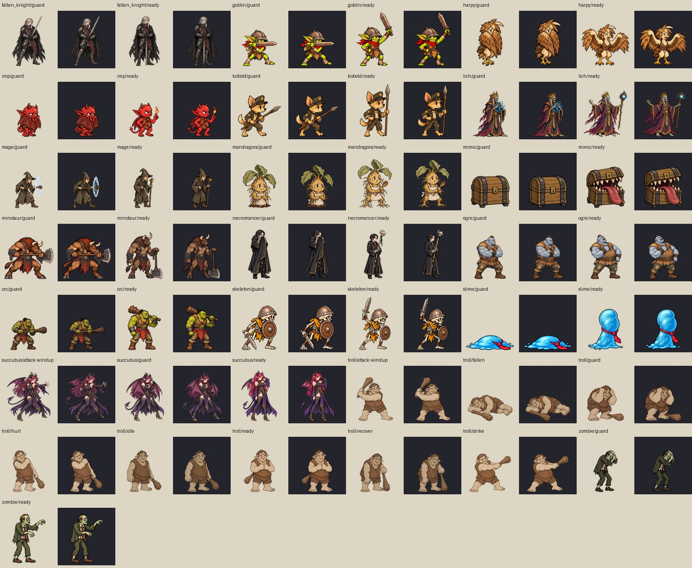

# 指示待ち・防御ポーズの絵（2026-09-15）

`SPEC_COMMAND_POSE_2026-09-15.md` §1 の画像納品。ゲームへの登録・演出配線は別作業。

## 内容

- 採用可能18種に `ready.webp`（指示待ち）と `guard.webp`（防御）、36枚。
- オーナー追記により、トロルは立ち絵のやさしく少し間の抜けた顔から全8ポーズを制作。旧戦闘絵は参照しない。
- サキュバスは髪に手を添えて余裕を見せる `ready`、翼で守る `guard`、前方に手を伸ばして仕掛ける `attack-windup`。攻撃準備の既存画像も置換。
- 合計43枚の出力（新規36枚、既存7枚の置換）。すべて512×512透過WebP。



## 再生成・配置

内蔵 `image_gen` で生成。採用した透過PNGは各ユニットの `*-source.png` に保持し、プロンプトと拡大率は `assets/battle/command-poses.json` に記録。

```sh
python scripts/prepare_command_poses.py --preview
python scripts/prepare_command_poses.py
```

顔・胴体をidleと比較して画像ごとに拡大率を設定。ポーズの外接矩形を一律に引き伸ばさず、接地の基準をy=492に合わせる。個別生成のため線・色には若干の揺れがある。

トロルとサキュバスの今回の変更箇所は、旧 `motion-source.png` より個別 `*-source.png` と本マニフェストを優先する。旧ソースは履歴用として残す。

## Claudeへの引き継ぎ

- `src/` は変更しない。18種の `BATTLE_SPRITES` にready/guardを登録し、art-coverageを210から246へ更新する。
- その後、仕様§2の指示待ち→選択→確定後の構えを配線する。
- 通常の攻撃確定後は既存attack-windup、防御確定後はguard。readyは確定前の指示待ち。
- トロル6ポーズとサキュバスattack-windupは既存パスの差し替えなので、新しい登録は不要。

## 検証

- 43枚すべて512×512、RGBAのalpha範囲0〜255、可視領域の接地下端y=492。WebP合計約1.83MiB。
- 全画像のブラウザdecode、明暗背景一覧、idleとの比較を確認。
- `battlefield`、`effects`、`vfx-lifecycle`の既存ブラウザテストが通過。
- `battle-preview.html`でトロル対サキュバスを組み、390px/1280px幅、x1/x2/x4の命中と復帰を確認。ページの例外なし。
- ready/guardは未登録なので、この時点では本番の指示待ち演出を検証したものではない。
