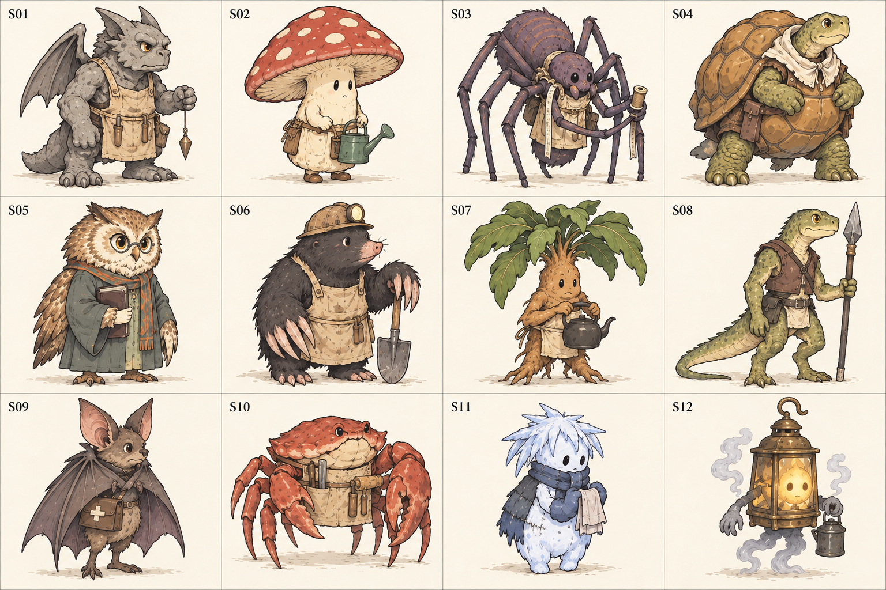
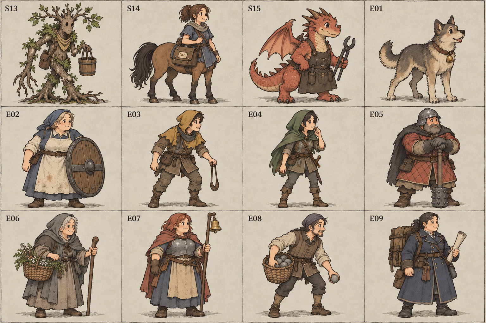
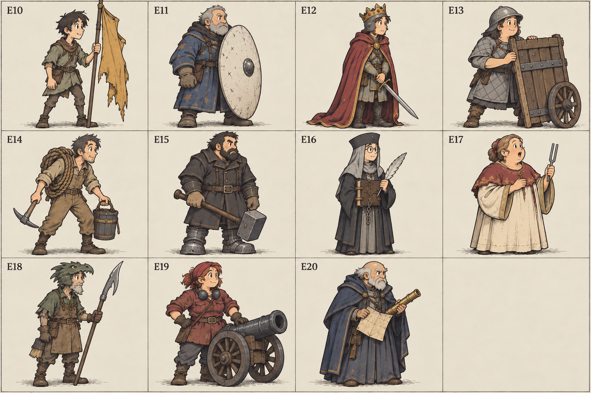

# 新種族・敵・技の案帳（2026-09-13）

**オーナーが選ぶための未採用案。新種族15・敵20・技30。実装・習得先・追加戦闘数は決めない。**

種族はS、敵はE、技はTの番号で指せる。種族技15本はT01〜T15として技30案の内数に含めた。
一覧の下絵は35体を12・12・11体の3枚に分けた。完成立ち絵やモーションではない。

参照した本線は `3d93989`。既存17種、種族技17・上位技8、カタログの技25と敵役6を照合した。
チケットの「カタログ31」はコード上では技25＋敵役6に分かれているため、両方と比較している。
地域は現行の段階1〜14、裏方の職業は城下町経済の現行の職業一致を土台にした。
第二幕設計書の古い候補にあるサキュバス・ミノタウロス・リッチは既存種なので数えていない。

## 選ぶ基準

- 見た目と面接の一言から「どこで働いてほしいか」が浮かぶ。
- 戦闘の役目が重なっても、守る相手・引き受ける損・仕事との接点が違う。
- 技は一文、主な効果は二つ程度。数値だけ変えた既存技や名前だけの別技は数えない。
- 人を材料・担保にしない。奪うのは敵の武器や軍資金まで。味方の自傷には本人の身を分ける理由を持たせる。
- 新しい施設管理や毎日の操作を足さない。裏方は現在の留守番と職業一致の範囲で居場所を考える。
- 追加敵は既存戦闘の差し替え候補。全員と順番に戦わせる案ではない。

設計原則15節の1・2・4・6・7を、仕事・性格・守り方の違いで支える。8の操作負担を増やさず、
9・10のために裏方の仕事を戦闘倍率だけへ置き換えない。試遊では種類数より「次は別の人を採りたいか」を見る。

## 新種族15案

性格は種族の絶対的性質ではなく、下絵にした応募者一人の見本。応募地域も出身・流入の候補であり、解放条件ではない。

| ID・名前 | 一言の性格 | 主な役目・職業候補 | 種族技（kind／一文） | 面接の一言 | 応募してきそうな地域 | 既存種との違い |
|---|---|---|---|---|---|---|
| S01 ガーゴイル | 持ち場を離れるのが苦手 | 前衛／石工 | T01 煙よけの翼：`cleanse + cover`／仲間の足止め・魅了・燃焼を払い、そのままかばう。 | 「雨の日の見張りも、手当は同じですか」 | 大神殿の外壁、王都城門 | 骸骨兵と同じ盾役でも、弱った仲間をまず動ける状態へ戻す。石工として留守番にも向く。 |
| S02 キノコ人 | 静かな場所ではよく気がつく | 支援／薬草の調達 | T02 眠りのかさ：`heal + stun`／敵を少し回復する代わりに、高確率で次の手番を止める。 | 「地下でも育ちますが、休憩は地上で取りたいです」 | 村はずれの林、街道の湿地 | スライムの足止めと違い、敵を治して時間を買う交換が見える。 |
| S03 クモ織り | ほつれを見つけると放っておけない | 裏方／備品係 | T03 つぎ当て：`heal + cover`／傷ついた仲間を少し治し、自分がその前に立つ。 | 「制服の直しもできます。袖の数は問いません」 | 城塞都市の仕立て通り、大聖堂の織物工房 | コボルトの救助と違い、位置を動かさず手当てと肩代わりを引き受ける。備品係として研究所の職業一致候補。 |
| S04 カメ甲兵 | 一度決めた仕事を最後まで続ける | 前衛／門番 | T04 甲羅押し：`shatter_guard + push`／敵のまもるを崩して殴り、最後尾へ押す。 | 「急ぎの配達以外なら、お任せください」 | 街道の渡し場、隣国国境 | トロルの自己回復と違い、敵の盾をどかして仲間の通り道を作る。 |
| S05 フクロウ人 | 人の言い間違いを小声で直す | 遠隔／書庫の備品係 | T05 読み上げ：`disarm + spirit_gift`／敵の攻撃を弱めながら、味方一人へ気合を渡す。 | 「夜勤は歓迎です。朝礼だけ少し遅くできますか」 | 大神殿の書庫、隣国の大聖堂 | 魔法使いの全体攻撃と違い、一人の技を出しやすくする読み役。 |
| S06 モグラ人 | 口数は少ないが足元の危険は必ず知らせる | 裏方／石工 | T06 足元くずし：`shatter_guard + disarm`／敵のまもるを崩す一撃で、攻撃力も下げる。 | 「壁の裏側まで、きちんと直します」 | 関所の石切り場、街道の砦 | オーガの大打撃と違い、堅い敵を仲間が扱いやすくする。石工の職業一致で鍛冶場にも関われる。 |
| S07 マンドラゴラ | 声は大きいが言葉遣いは丁寧 | 支援／料理人 | T07 目覚めの声：`cleanse`の全体対象案／全員の足止め・魅了・燃焼を払い、次の自分の手番は休む。 | 「食材とは別の棚に、名札を付けていただければ」 | 村はずれの畑、城塞都市の薬草市 | 死霊術師の蘇生と違い、まだ立っている人をまとめて助ける。料理人として酒場の職業一致候補。 |
| S08 リザードマン | 距離を取りながら相手をよく見る | 前衛／渡し守 | T08 槍の通り道：`pierce + double`／防御値を無視する小さな二撃を同じ敵へ通す。 | 「水辺の持ち場でしたら、長く勤められます」 | 街道の川岸、隣国国境 | オークの横薙ぎと違い、堅い一人に二度届く槍役。 |
| S09 コウモリ人 | 用心深いが、傷ついた相手には近づける | 遠隔／夜間の配達 | T09 分ける吸血：`drain + heal`／敵から吸った分を、自分ではなく選んだ仲間へ渡す。 | 「夜の届け物は得意です。受取印は朝でも」 | 大神殿の鐘楼、隣国高地の洞穴 | ハーピーの速攻と違い、傷ついた仲間のために飛ぶ。配達の職業一致で工場にも向く。 |
| S10 カニ職人 | 検品は厳しいが弁償の話は公平 | 裏方／鍛冶 | T10 武器あずかり：`disarm + steal`／敵の武器を傷め、勝てば回収品が金になる。 | 「細かい修理は左のはさみ、大仕事は右です」 | 城塞都市の水路工房、隣国国境 | インプの追い剥ぎと違い、敵のHPを削らず攻撃力と備品を狙う。鍛冶の職業一致候補。 |
| S11 雪わらし | 世話好きだが、何でも冷やしてしまう | 支援／倉庫番 | T11 冷たい手当て：`heal + stun`／仲間を大きく治す代わりに、その仲間は次の手番を休む。 | 「冷蔵の仕事なら、設備は私で足ります」 | 隣国高地、連合本陣への山道 | トロルの休むと違い、誰を休ませて治すか選べる。倉庫番の職業一致で工場にも向く。 |
| S12 ランタン霊 | 消灯時間には厳しいのに自分は眠そう | 遠隔／夜の見張り | T12 灯分け：`spirit_gift`に自傷を組合せ／自分のHPを削り、味方一人に気合を渡す。 | 「消えている間も、呼ばれれば戻ります」 | 王都の旧街路、街道の砦 | リッチの広い攻撃と違い、身を削って別の人の一手を支える。 |
| S13 ツリーマン | 人の話を最後まで聞いてから動く | 支援／庭と建材の調達 | T13 根の囲い：`mend_all + wall_all`／全員を少し治し、全員でそのラウンドを守って過ごす。 | 「庭の仕事を希望します。移植は着任の時だけで」 | 大平原の林帯、隣国国境 | キングスライムの攻める大波と違い、全員で一息つく時機を選ぶ。 |
| S14 ケンタウロス | 人を待たせるのを嫌う | 前衛／配達 | T14 前後交代：新`swap`／最後に動き、自分と味方一人の並び順を交換する。 | 「配達は任せてください。階段だけは相談を」 | 大平原、隣国高地のふもと | ミノタウロスは敵を押すが、こちらは自軍の持ち場を交代する。配達の職業一致で工場にも向く。 |
| S15 小竜 | 自信満々だが道具はまだ借り物 | 遠隔／鍛冶見習い | T15 加減の炎：`aoe + shatter_guard`／敵全員のまもるを崩し、小さな炎を浴びせる。 | 「焼き過ぎた分は、練習の記録に残してあります」 | 街道の砦の炉、高地の竜舎 | 魔法使いの大火力と違い、全員の守りをはがして次の仲間へ渡す。竜騎兵の乗り物として扱わない。 |

S07やS15は姿そのものに少し可笑しさがあるが、働きは真面目。ダジャレ名は0件。
新種族全員が新しい経済効果を持つわけではなく、職業一致の候補は既存の割引先へつなぐだけ。

## 敵20案

敵は敵側の生活や任務を持つ。人間を採用種族に加える案ではない。
役は全て既存8役のいずれかで、新役は提案しない。**役は土台、以下の固有行動の条件は未実装案**。
既存役を指定するだけで固有行動まで出る、という意味ではない。

| ID・名前 | 段階・地域 | 役 | 行動の癖（一つ） | 見た目で分かる持ち場 |
|---|---|---|---|---|
| E01 村の番犬 | 第一幕1・村はずれ | fighter | 最初のラウンドだけ一番前の相手を必ず狙う。 | 首輪の小さな鈴、低い四足の構え。 |
| E02 粉ひき守り | 第一幕1・村はずれ | shield | 自分よりHPの少ない仲間がいる時だけかばう。 | 粉の付いた前掛けと樽のふた。 |
| E03 橋番ニコ | 第一幕2・街道 | archer | 奇数ラウンドは最後尾を狙い、偶数は普通に撃つ。 | すり切れた黄色い頭巾と投石ひも。 |
| E04 笛吹き斥候リオ | 第一幕2・街道 | rogue | 2ラウンド目だけ、気合が最も多い相手を狙う。 | 緑の頭巾と短い笛。 |
| E05 関所長ダグ【ボス】 | 第一幕3・関所 | brute | 仲間が一人倒れた次のラウンドに、一度だけ大技を構える。 | 鉄棒のような武器と赤茶の厚着。 |
| E06 巡礼の薬師メル | 第一幕4・大神殿 | priest | 傷ついた仲間へT26「治して下げる」を使い、自分が前へ出る。 | 薬草かごとくたびれた緑灰の外套。 |
| E07 鐘守りロゼ【ボス】 | 第一幕4・大神殿 | commander | 開幕ではなく2ラウンド目に一度だけ号令を出す。 | 鐘付きの杖と銅色の頭巾。 |
| E08 城壁の石投げ役 | 第一幕5・城塞都市 | caster | 大きな石を見せた次のラウンドだけ全体攻撃をする。 | 石を入れたかごと長い腕。 |
| E09 補給隊長ベラ | 第一幕5・城塞都市 | commander | 自分以外に二人以上いる間だけ号令を選ぶ。 | 角ばった背負い箱と巻いた荷物表。 |
| E10 平原の旗持ちトーリ | 第一幕6・大平原 | commander | 自分が先頭にいるラウンドだけ号令を使う。 | 高い古旗に対して細い体。 |
| E11 白盾の門番ルーク【ボス】 | 第一幕7・王都城門 | shield | 開幕はまもり、以後は後ろの一人をかばう。 | 全身を隠す白い大盾、継ぎ当ての青い上着。 |
| E12 王の影武者イオ【ボス】 | 第一幕8・王都の別働隊 | fighter | 3ラウンド目に一度だけT27「決闘の礼」で勝負を急ぐ。 | かぶとの上の小さな冠と長過ぎる外套。 |
| E13 国境の荷車兵 | 第二幕9・隣国国境 | shield | 最後尾にいる間だけ直前の仲間をかばう。 | 車輪の残る荷車の側板を盾にする。 |
| E14 橋落としの工兵 | 第二幕9・隣国国境 | caster | 3ラウンド目に一度だけT29「錆び砂」を投げる。 | ロープ、つるはし、ふたをした砂桶。 |
| E15 鉄靴の隊長ヘルト【ボス】 | 第二幕10・街道の砦 | brute | 先頭から押し下げられたら、次のラウンドに一度だけ大技を構える。 | 大きな平たい鉄靴と短い戦槌。 |
| E16 審問書記サラ | 第二幕11・大聖堂 | rogue | 直前のラウンドに技を使った相手を一人選んで狙う。 | 灰色の頭布と鎖付きの記録帳。 |
| E17 聖歌の先導エマ | 第二幕11・大聖堂 | priest | HPの割合が一番低い仲間だけを、毎回優先して治す。 | 厚い赤布と音を合わせる音叉。 |
| E18 竜舎の槍番デン | 第二幕12・高地 | archer | 偶数ラウンドにT28「盾の裏を突く」で最後尾へ届く。 | 竜形の古かぶと、長い鉤付きの槍。 |
| E19 砲列長マルタ【ボス】 | 第二幕13・連合本陣前 | caster | 全体攻撃の後は、必ず一手番を装填に使う。 | 小さな車輪砲と耳当て、現場監督の上着。 |
| E20 連合の軍師オルン【ボス】 | 第二幕14・連合本陣の外郭 | commander | 2ラウンド目に一度だけT30「力を回す」で自分より仲間を強める。 | 折った地図と短い望遠鏡、前かがみの老人。 |

ボス格は7体（E05・E07・E11・E12・E15・E19・E20）。第一幕の王都、第二幕の本陣に節目役を置いた。
E12・E20は別働隊・外郭戦の差し替え候補で、勇者アレン一行や再来の幕切れを勝手に置き換えない。
大技・装填・号令は前の窓で予告する。倒す順番やまもるを試せるようにし、見えない条件で罰しない。

## 技30案

**案の数は30。新kindは `swap` の1種類だけ。** `+` は既存処理をつなぐ設計メモで、実在するkind文字列ではない。
現行エンジンには汎用の複合技機能がなく、採用時には対象・順番・倍率の接続が必要。
既存kindの新しい対象指定や反動を含め、データ行を貼るだけで動くと保証するものではない。
表の「一文」が最終的な挙動であり、二つのkindの元の攻撃をそれぞれ出して二重に殴る意図はない。

HP回復・自傷は最大HP比、与ダメ回復は実際に減らしたHPを基準にする。×は攻撃倍率。
味方用の気合は1〜3。敵用の0は「気合を払わない」の意味で、表の回数制限を予告付きで守る。
T01〜15は種族技、T16〜25は上位技、T26〜30は敵行動。未採用なので解放時期は未確定。

| ID・技名 | 誰向け | kind・接続案 | 気合 | 効果と制限を一文で | 台詞 | 既存カタログとの違い |
|---|---|---|---|---|---|---|
| T01 煙よけの翼 | 種族技：S01 | cleanse + cover | 2 | 味方一人の足止め・魅了・燃焼を即座に払い、このラウンド自分が60%でかばう。 | 「息ができたら、後ろにいろ」 | 気付けだけでは続く攻撃を受けないが、解除役がその危険も引き受ける。 |
| T02 眠りのかさ | 種族技：S02 | heal + stun | 1 | 敵一人をHP15%回復してから、80%で次の手番を止める。 | 「少し休んでいきませんか」 | 敵を治す損と足止めを交換し、外れた場合も回復は残る。 |
| T03 つぎ当て | 種族技：S03 | heal + cover | 2 | 味方一人をHP15%治し、このラウンド自分が80%でかばう。 | 「ここから先は、ほつれません」 | 配り薬の全体回復や引き寄せ救助と違い、位置を変えず一人の手当てと保護を行う。 |
| T04 甲羅押し | 種族技：S04 | shatter_guard + push | 2 | 敵一人のまもるを消して×0.8で殴り、生きていれば最後尾へ押す。 | 「通してもらいます」 | 盾崩しに隊列移動が加わり、突進だけでは残るまもるもはがせる。 |
| T05 読み上げ | 種族技：S05 | disarm + spirit_gift | 2 | 敵一人の攻撃力を3下げ、選んだ味方一人に気合1を渡す。 | 「次の手、準備をお願いします」 | 武器はじきと違って攻撃しない手番が別の仲間の技の準備にもなる。 |
| T06 足元くずし | 種族技：S06 | shatter_guard + disarm | 2 | 敵一人のまもるを消して×0.5で殴り、攻撃力を3下げる。 | 「そこ、崩れます」 | 盾崩しの後も敵の攻撃低下が残り、堅い大男を弱める仕事ができる。 |
| T07 目覚めの声 | 種族技：S07 | cleanse（全味方へ拡張） | 2 | 全員の足止め・魅了・燃焼を即座に払い、次の自分の手番は息切れで休む。 | 「皆さん、朝です！」 | 気付けの数値違いではなく、複数同時解除と本人の次手番を交換する。 |
| T08 槍の通り道 | 種族技：S08 | pierce + double | 2 | 防御値を無視する×0.5の攻撃を同じ敵へ二回行う。 | 「一本、通る道がある」 | 二連打は防御で二度減るが、これは二撃とも防御値を無視する代わりに威力が小さい。 |
| T09 分ける吸血 | 種族技：S09 | drain + heal（受取人変更） | 1 | 命中80%で敵に×1の攻撃をし、与ダメの30%を自分以外の指定味方へ渡す。 | 「これは、あなたの分」 | 吸い上げの自己回復から、前衛を支える遠隔回復へ役目が変わる。 |
| T10 武器あずかり | 種族技：S10 | disarm + steal | 1 | 成功70%で敵の攻撃力を3下げ、勝利時の回収品1Gを予約する。 | 「危ない物はこちらへ」 | 撃破時の戦利品回収ではなく、まだ生きている敵の武器を狙う。 |
| T11 冷たい手当て | 種族技：S11 | heal + stun（味方対象） | 1 | 味方一人をHP40%回復する代わりに、その味方の次の手番を一回休ませる。 | 「動かないで、冷やします」 | 休むの他人版で、支援役と治される人の両方が攻撃を手放す。 |
| T12 灯分け | 種族技：S12 | spirit_gift + selfHp | 1 | 自分のHP20%を削ってHP1は残し、別の味方一人に気合1を渡す。 | 「まだ、消えるほどではありません」 | 気合2を払う差し入れと違い、残す気合のためにHPを払う。 |
| T13 根の囲い | 種族技：S13 | mend_all + wall_all | 3 | 全員をHP10%治してまもる状態にし、このラウンドは全員で通常行動を休む。 | 「今は、根を下ろそう」 | 総員防壁に立て直しを組み込み、休むラウンドに意味を持たせる。 |
| T14 前後交代 | 種族技：S14 | **新swap** | 1 | 最後に動き、自分と選んだ味方一人の並び順を交換する。 | 「持ち場、代わります」 | 引き寄せ救助は一人を最後尾へ送るが、これは二人の位置を交換し、かばわない。 |
| T15 加減の炎 | 種族技：S15 | aoe + shatter_guard | 3 | 敵全員のまもるを消し、それぞれに×0.4の炎を浴びせる。 | 「鎧は残します。たぶん」 | 燃焼や大火力ではなく、複数の防御姿勢を一度にはがす。 |
| T16 屋根になる | 上位技：S01・骸骨兵 | cover + spirit_gift | 2 | 味方一人へ気合1を渡し、このラウンド自分が80%でかばう。 | 「次の仕事は、あなたに」 | 守るだけでなく、守られた者に技を使う準備を渡す。 |
| T17 群れの吸い上げ | 上位技：スライム・S09 | aoe + drain | 3 | 敵全員に×0.3で攻撃し、与ダメ合計の30%を自分に戻す。 | 「少しずつ、いただきます」 | 一人を大きく吸う技とは、敵の人数で向く場面が変わる。 |
| T18 武器を折る二打 | 上位技：オーク・S10 | double + disarm | 3 | 同じ敵へ×0.5を二回当て、一撃目で攻撃力を3下げる。 | 「まず武器、次に本体」 | 二連打の途中で弱体化を入れ、倒し切れなくても仕事を残す。 |
| T19 継ぎ目のとどめ | 上位技：S08・リッチ | pierce + execute | 2 | HP30%以下の敵へ防御値を無視する×3の一撃を放ち、それ以外には反撃される。 | 「ここなら、終わらせられる」 | とどめの見切りに防御無視を組み、堅い瀕死の相手を狙う理由を作る。 |
| T20 静かな合図 | 上位技：S05・魔法使い | cleanse + spirit_gift | 3 | 味方一人の足止め・魅了・燃焼を即座に払い、気合1を渡す。 | 「もう一度、お願いします」 | 気付けと違い、復帰した人の次の技まで支える。 |
| T21 古参の手渡し | 上位技：ゾンビ・S06 | veteran + spirit_gift | 2 | 命中85%で被撃倒歴に応じた一撃を当て、別の味方へ気合1を渡す。 | 「次はお前が覚える番だ」 | 常連の勘の履歴を本人の火力だけで閉じず、次の人の技につなぐ。 |
| T22 囮の金袋 | 上位技：インプ・ミミック | steal + scatter | 2 | 勝利時3Gを予約して敵の狙いを散らすが、自分は狙われやすくなる。 | 「返してほしければ、こちらへ」 | 回収後も安全な金貨技ではなく、囮役が襲われるリスクを負う。 |
| T23 寝かせて救う | 上位技：死霊術師・S11 | revive + stun | 2 | 倒れた仲間一人をHP30%で起こすが、その仲間の次の手番は休ませる。 | 「目が覚めても、まだ起きないで」 | 死者の手の自傷を、蘇生された者がすぐ働けない代償へ替える。 |
| T24 最後の持ち場 | 上位技：トロル・ゾンビ | rally_fallen + drain | 3 | 倒れた仲間が多いほど強く殴り、与ダメの30%を自分に戻す。 | 「戻って来るまで、ここにいる」 | 穴を埋めるの一撃を自己回復へつなぎ、残った者の立て直しにする。 |
| T25 合図で交代 | 上位技：S14・コボルト | swap + buff（単体対象） | 2 | 指示直後に自分と味方一人の位置を交換し、その味方の今ラウンドの通常攻撃を30%上げる。 | 「前は任せた。私は後ろへ」 | 前後交代より早く、交代して前へ出る者の攻撃を支える。 |
| T26 治して下げる | 敵行動：E06 | heal + swap | 0 | HP半分以下の仲間を25%治し、その仲間と自分の位置を交換する。 | 「下がって休みなさい」 | 回復と引き寄せ救助の組合せではなく、治療者自身が傷ついた者の位置へ立つ。 |
| T27 決闘の礼 | 敵行動：E12 | strike + buff（敵対対象） | 0 | 一戦一回、敵一人に×1.5で斬りかかるが、その相手の今ラウンドの通常攻撃も30%上げる。 | 「正面から、お願いします」 | 反動で自分HPを削るのでなく、狙った相手の反撃を強くする。 |
| T28 盾の裏を突く | 敵行動：E18 | flank + shatter_guard | 0 | 偶数ラウンドに敵最後尾のまもるを崩して×0.8で殴り、自分も最後尾へ下がる。 | 「届く所は、そこにもある」 | 回り込みでは残る最後尾のまもるをはがすため、後ろの安全を過信できない。 |
| T29 錆び砂 | 敵行動：E14 | aoe + disarm | 0 | 一戦一回、敵全員へ×0.3の攻撃をし、攻撃力を2ずつ下げる。 | 「橋より先に、武器を止める」 | 全体攻撃と武器はじきを組み、単なる威力の大きい砲撃と分ける。 |
| T30 力を回す | 敵行動：E20 | buff + disarm（自分対象） | 0 | 一戦一回、自分の攻撃力を3下げ、自分以外の味方全員の今ラウンドの通常攻撃を30%上げる。 | 「私の持ち場は、皆に任せる」 | 普通の号令と違い、残った軍師本人はその後も弱いままになる。 |

### 接続時に決める境界（今は実装しない）

- T05は「敵一人と味方一人」、T09は「攻撃先と回復先」の二対象になるため、採用時に既定の片側選択を検討する。
  二回の対象タップを必須にして操作負担を増やさない。例えばT05は敵を指定し、味方は気合最少を既定にする。
- T02は回復→足止め判定の順。外れても敵の回復を取り消さない。
  T11・T23の休むは次に回ってくる一手番で、既存の一回限りの足止めを用いる。
- 肩代わりする被ダメージはT03・T16が元の80%、T01が60%。自分がまもると既存どおりかばえない。
  T13は全員の行動を止めることも窓に出す。既存の即時技と同時に選んだ際の支払いは採用時に確認する。
- T08・T18は対象が一撃目で倒れたら二撃目を打たない。T19も耐性・まもる・かばうは無視せず確殺ではない。
- T21の倍率は既存veteranどおり×1＋本人のdowned1回につき0.1、上限×1.5。気合渡しは命中した時だけ。
  T24は既存rally_fallenどおり、非召喚の戦闘不能が0人なら×0.5、いれば×1＋人数×0.5。
- T10・T22の金貨は勝利時だけ。敵の人員を連れ去る効果や借金の担保にする効果はない。
- T25・T27・T30の鼓舞は今ラウンドだけ。通常攻撃の倍率であり、すべての直接技へ乗るとの説明にはしない。
  全ての攻撃力低下はこの戦闘中のみ、下限1。永続名簿を弱くしない。
- 新kind `swap` は「戦場にいる味方二人の配列位置だけを交換する」。一人では不発、倒れた者・不在者・敵は対象外。
  既存の押し下げやrescueでは選んだ二人の位置交換ができないため、1種類だけ提案した。
  T14は自分の手番を最後にして交換、T25は指示直後、T26は治療後に行う。速度値・そのラウンドの確定済み行動順は変えない。
- 新役は0。既存役の予告・実行への差し込みは採用後にClaudeと分担を決める。
  組合せのための仕組みを先に一般化せず、選ばれた少数の技に必要な接続だけを検討する。

## まず選ぶなら

### 種族3

| 候補 | 一行の理由 |
|---|---|
| S03 クモ織り | 備品係として留守番にも意味があり、戦場では手当てした相手を自分で守る人物像が分かりやすい。 |
| S06 モグラ人 | 石工の職業と敵の足元を崩す仕事がつながり、既存の大火力前衛とは違う採る理由ができる。 |
| S14 ケンタウロス | 配達役としての姿と仲間の持ち場交代が一致し、誰を先頭に置くかを戦闘中にも選べる。 |

### 敵5

| 候補 | 一行の理由 |
|---|---|
| E04 笛吹き斥候リオ | 序盤の予告付き気合狙いで、温存する人を守る判断を短い戦闘でも試せる。 |
| E07 鐘守りロゼ | 2ラウンド目の鐘が見える節目になり、号令前に誰へ攻撃を集めるか考えられる。 |
| E13 国境の荷車兵 | 後ろからかばう姿が見た目と一致し、盾は先頭だけという思い込みを一度だけ崩せる。 |
| E17 聖歌の先導エマ | 分散攻撃と集中攻撃の違いが回復先から分かり、特別な新ルールを増やさず敵の編成を変えられる。 |
| E20 連合の軍師オルン | 仲間へ力を回して本人は弱くなるため、本陣の人数を減らした成果が最後の対面に残る。 |

### 技10

| 候補 | 一行の理由 |
|---|---|
| T01 煙よけの翼 | 状態を治すだけで終わらず、その人を次の攻撃から守る一手にできる。 |
| T02 眠りのかさ | 敵を治してでも時間が欲しいか、損と得が一文で比較できる。 |
| T03 つぎ当て | 傷ついた前衛を引き続き働かせるため、修理役も身を張る関係が見える。 |
| T06 足元くずし | 堅い敵への準備を火力役以外に任せられ、次の仲間の出番を作れる。 |
| T07 目覚めの声 | 複数人が止められた場面を戻す役ができ、本人の息切れも読みやすい。 |
| T09 分ける吸血 | 敵を殴りながら傷ついた別の仲間を支えるため、遠隔役の採り方が広がる。 |
| T11 冷たい手当て | 大回復と一手休みの交換で、単に回復量の多い技を常に選ぶ形を避けられる。 |
| T14 前後交代 | 押し下げられた仲間を戻すなど、既存の隊列変化への手軽な返しになる。 |
| T20 静かな合図 | 古い仲間の技をもう一度使う準備を支援役が作り、育てた人の見せ場を守れる。 |
| T26 治して下げる | 敵の治療者が代わりに前へ出るため、回復を見せた後にも攻める糸口が残る。 |

このおすすめも未採用。まず種族1・敵1・技2程度をオーナーが選び、既存の戦闘に置いて確かめる。
全65案の投入や戦闘数の追加を前提にしない。選定後の実装・担当・試遊条件は次の作業で決める。

## 下絵シートの索引

画像内の番号を正とし、左上から右へ、上の段から下の段へ読む。35体は重複なし。

### シート1：新種族12体



| | 左1 | 左2 | 左3 | 左4 |
|---|---|---|---|---|
| 上段 | S01 ガーゴイル | S02 キノコ人 | S03 クモ織り | S04 カメ甲兵 |
| 中段 | S05 フクロウ人 | S06 モグラ人 | S07 マンドラゴラ | S08 リザードマン |
| 下段 | S09 コウモリ人 | S10 カニ職人 | S11 雪わらし | S12 ランタン霊 |

### シート2：新種族3体＋敵9体



| | 左1 | 左2 | 左3 | 左4 |
|---|---|---|---|---|
| 上段 | S13 ツリーマン | S14 ケンタウロス | S15 小竜 | E01 村の番犬 |
| 中段 | E02 粉ひき守り | E03 橋番ニコ | E04 笛吹き斥候リオ | E05 関所長ダグ |
| 下段 | E06 巡礼の薬師メル | E07 鐘守りロゼ | E08 城壁の石投げ役 | E09 補給隊長ベラ |

### シート3：敵11体



| | 左1 | 左2 | 左3 | 左4 |
|---|---|---|---|---|
| 上段 | E10 平原の旗持ちトーリ | E11 白盾の門番ルーク | E12 王の影武者イオ | E13 国境の荷車兵 |
| 中段 | E14 橋落としの工兵 | E15 鉄靴の隊長ヘルト | E16 審問書記サラ | E17 聖歌の先導エマ |
| 下段 | E18 竜舎の槍番デン | E19 砲列長マルタ | E20 連合の軍師オルン | 空欄 |

生成は内蔵 `image_gen`。全て一枚単位で作った一覧下絵で、個別画像の完成・切り出しは行わない。
画風は2026-09-13のオーナー指示で調整。既存ハーピーの柔らかい目元と愛嬌を基準に、
丸みのある形、少し大きめの顔、表情の読める目、しなやかな手描き線へ寄せた。
細かいハッチング・写実的な顔のしわ・汚れ・紙のざらつきを減らし、明るめのくすんだ色と少ない陰影で描く。
昔の日本の冒険RPGに感じる親しみやすさを目指す。特定作品の人物や衣装には似せず、
年齢・体格・不機嫌さや気弱さなど各人の違いは残す。全員を幼くしたり、同じ笑顔にそろえたりしない。
実ゲームへの利用規格（透過・6ポーズ・足元合わせ）は今回の下絵には適用していない。


## 制作記録

### 柔らかいタッチへの修正

内蔵image_genで各シートを編集。第1参照は各旧シート、第2参照は `assets/battle/units/harpy/idle.webp`。
番号・キャラクター・並び・小道具を維持する条件で生成した。保存先は上の3枚と同じ。
シート3は最初の修正で変化が弱かったため、柔らかくなったシート2も参照にして再修正した。

<details>
<summary>シート3の再修正プロンプト（最終版）</summary>

```text
undefined
```

</details>

<details>
<summary>修正時のプロンプト3本</summary>

#### シート1

```text
Use case: style-transfer. Redraw the FIRST reference (contact sheet) with a modest but clearly visible shift toward soft, charming classic Japanese adventure-RPG manga illustration. The SECOND reference is the owner's approved harpy: use its warm expressive eyes, gentle rounded facial forms, slightly awkward endearing expression and friendly hand-drawn outline as the visual anchor, NOT its species or costume. Preserve every character identity, species, age, gender, clothing, identifying prop, number, cell position and overall pose from the first image. Keep elderly faces elderly and stern characters stern but approachable; do not give everyone the same smile. Slightly larger heads and expressive eyes, softer rounder hands and muzzles, flowing confident ink with subtle line-weight variation, broad simple color shapes, warm subdued colors with a little more freshness, only one or two soft cel shadows. Greatly reduce dense crosshatching, wrinkles, realistic skin anatomy, dirt speckles, sepia wash and heavy parchment texture. Plain light warm off-white background. Maintain adult character proportions around four to five heads where appropriate, NOT tiny baby chibis. Creatures retain distinct anatomies. Keep the flavor of humorous ordinary workers. Do not copy any existing franchise characters or iconic costumes. No glossy digital gradients, no cinematic light, no photorealism, no effects, no extra characters. This remains a rough thumbnail selection board, not individual finished assets. Exact output 1536x1024, four columns and three rows, fine quiet grid lines. All full bodies and props contained in cells. Preserve exactly the original ID labels and no other text. This sheet has twelve creatures labelled S01-S12 in row-major order. Do not insert the reference harpy as a thirteenth creature.
```

#### シート2

```text
undefined This sheet has twelve characters, labelled S13 S14 S15 E01 / E02 E03 E04 E05 / E06 E07 E08 E09. Keep centaur four horse legs, small dragon, tree person, ordinary four-legged dog. Human adults must gain warm appealing manga facial simplification and slightly rounder silhouettes while preserving their varied ages, genders and jobs. Preserve the bell staff, basket, barrel-lid shield and all other identifying props. Do not insert the reference harpy.
```

#### シート3

```text
undefined
```

</details>


<details>
<summary>初稿の生成プロンプト3本（修正前の記録）</summary>

### シート1

```text
Use case: stylized-concept. Create ONE rough selection contact sheet for a Japanese demon-army recruitment RPG, NOT individual finished portraits. 1536x1024 landscape, precise 4 columns x 3 rows, 12 equally sized separate cells, ONE fully visible full-body creature per cell. Pale warm grey flat paper background, discreet thin dividers, generous blank margins. Match a 1990s tabletop bestiary / Japanese Super Famicom monster manual: thick irregular black ink, muted matte flat colors, rough handmade thumbnail sketch detail, restrained cel shading, deliberately awkward ordinary workers, readable varied silhouettes. No cinematic lighting, no shiny rendering, no gacha beauty, no scenic backgrounds, no attack effects, no blood. Small plain legible ID labels at top left of each cell ONLY; exact labels S01 through S12 row-major. All characters three-quarter facing right, relaxed work stance. Do not turn them into identical humanoids. Row1: S01 squat grey stone gargoyle, short folded bat wings, chipped square muzzle, mason apron and small plumb line, serious night-watch worker; S02 ambulatory stout mushroom person, huge dull red spotted cap, cream stalk face, tiny arms and feet, carries small garden watering can, shy; S03 upright nonhuman spider weaver, eight dark mauve articulated limbs, round abdomen, four small eyes, cloth measuring ribbon and one spool, careful tailor; S04 broad tortoise soldier with ochre domed shell, beaked head, stubby scaled legs, plain padded collar, both hands braced on shell rim, patient. Row2: S05 owl person, round tawny feathered head and small folded wings, short robe, round glasses and one closed book, fastidious librarian; S06 stocky mole person, charcoal fur, huge digging claws, tiny eyes, canvas work apron, low miner helmet and small shovel, dusty embarrassed stoneworker; S07 mandrake root person, forked brown root legs, wide green leaf tuft, root arms, tea-kettle held carefully, courteous kitchen helper; S08 lean olive lizardman with long tail, blunt snout, small leather work vest, long plain spear vertical within cell, cautious ferry guard. Row3: S09 small bat person with large ears and broad membranous wings folded like a coat, russet-grey fur, medical satchel, wary night courier; S10 nonhuman crab craftsman, brick-red carapace, two asymmetric claws, six short walking legs, canvas tool belt with wooden mallet, dour workshop inspector; S11 snow sprite, small pale-blue compact snow body, icicle hair, patched dull indigo scarf and mittens, carries one folded cold cloth, no human glamour; S12 living brass lantern spirit, main body a dented opaque old lantern with small warm flame-face inside, two smoky little hands and bent ghostly feet, oilcan at side, sleepy lamplighter. Each ID once. Keep all 12 distinct anatomies fully inside cells; labels must not overlap drawing. This is a rough idea board for selecting characters, not a sprite sheet of motion poses.
```

### シート2

```text
Use case: stylized-concept. ONE rough thumbnail selection contact sheet for Japanese demon-army recruitment RPG. Landscape1536x1024, EXACTLY4 columns x3 rows,12 cells, one full-body character in each cell, individually readable silhouettes with generous margins, pale warm grey matte paper and fine simple dividers. Small legible cell IDs only at top left, no other writing. Thick slightly uneven black ink and rough handmade sketch detail, muted matte flat colors, restrained cel shading, 1990s overseas tabletop bestiary and Japanese SFC monster manual. Same subdued ink print style as previous idea sheet, unglamorous ordinary workers and awkward soldiers. This is conceptual thumbnail art, NOT finished individual assets. No blood, effects, scenery, cinematic glow, shiny armor or anime pinup. Mostly three-quarter facing right. Each ID once in exact row-major order. Row1: S13 tall knobbly TREE PERSON, walking root feet, sparse leafy antler branches, bark face, wooden bucket on one twig arm, gentle caretaker; S14 compact CENTAUR courier, humanlike upper torso explicitly on four small horse legs, adult female, tied brown hair, practical tunic, mail satchel, calm upright work stance, complete horse body and tail contained in cell; S15 SMALL DRAGON apprentice, terracotta scales, round snout, two short folded wings, four legs and tail, oversized dark leather smith apron and iron tongs, proud but clumsy; E01 village GUARD DOG, ordinary stocky grey-brown dog on four legs, leather collar with small bell, ears alert, clearly dog not kobold. Row2: E02 mill keeper, stocky middle-aged human woman in flour-dusted apron and muted blue kerchief, large round wooden barrel-lid shield, calm protective expression; E03 bridge guard Niko, lean young adult human man with old mustard hood, short sling in hand and pouch, patched traveller boots, cautious; E04 whistle scout Rio, slender human young woman in dusty green hood, small whistle held near face and short sheathed dagger, impatient; E05 gate chief Dag, very broad middle-aged human man with iron-bar mace braced vertically, rusty red quilted coat and dented helmet, no crown, exhausted authority. Row3: E06 pilgrim herbalist Mel, elderly human woman with sage-grey cloak, basket of simple herbs and wooden walking stick, stern kindly face; E07 bell keeper Rose, stout human adult woman with short copper-colored hooded mantle, bell-headed staff and simple iron breastplate, solemn; E08 wall stone-thrower, lanky human adult man in worn town-guard padded vest, carrying a wicker stone basket on hip and one stone in hand, tired workman's face; E09 quartermaster Vera, tall broad-shouldered human woman with square rigid backpack, rolled manifest and practical navy coat, severe organized posture. Twelve cells, exact IDs S13 S14 S15 E01 / E02 E03 E04 E05 / E06 E07 E08 E09. Do not duplicate characters. Keep full figures within each cell.
```

### シート3

```text
Use case: stylized-concept. Make ONE rough enemy thumbnail selection board, landscape1536x1024, a clean 4 columns x3 rows grid. EXACTLY11 full-body HUMAN enemy character thumbnails in cells, last bottom-right twelfth cell BLANK. Pale warm grey matte paper, fine dividers, small plain readable cell ID upper left. Thick uneven black ink contours, sparse handmade hatching, subdued matte flat colors, restrained cel shadows, 1990s tabletop RPG bestiary / Japanese Super Famicom monster manual. Workaday, believable, mildly awkward soldiers of varied ages, builds and genders; no glossy heroic fantasy, cinematic light, huge effects, scenery, blood, watermark. All face mostly three-quarter right, full silhouettes inside their cells; miniature concept roughs for selection, not completed portraits or six-pose sprites. Exact row-major cells: Row1 E10 plain-banner bearer Tori: very slender human young adult man in dull grey-green militia tunic, tall frayed muted ochre flag on pole, wide worried eyes; E11 white-shield gatekeeper Luke: square elderly human man with close-cropped grey beard, huge plain ivory oval shield covering torso, blue patched long coat and broad boots, stubborn; E12 royal double Io: slim nervous adult human man, ill-fitting dull burgundy royal cape, modest gold crown over iron helmet, plain short sword downward, cloak slightly too long, clearly reluctant stand-in; E13 border cart soldier: sturdy human middle-aged woman in heavy grey quilt, braces a detached rectangular wooden cart side with ONE visible wheel as makeshift shield, practical worker helmet, no separate cart creature. Row2 E14 bridge demolition engineer: wiry human middle-aged man in tan work overalls, coiled rope over shoulder, short mattock and sealed powder bucket, focused, no lit fuse or explosion; E15 iron-boot captain Helt: broad stocky human man, large flat iron boots, short dark charcoal coat and blunt war hammer held low, cropped dark beard, impatient; E16 inquisitorial scribe Sara: middle-aged human woman with severe grey veil, flat cap, closed chained record book and large quill, thin straight silhouette, no glowing magic; E17 choir leader Emma: mature broad human woman with plain cream choir robe and faded red shoulder scarf, holds one tuning fork, mouth slightly open singing, no musical-note graphics. Row3 E18 dragon-stable spearman Den: lanky older human man, battered green dragon-head-shaped helmet, long hooked spear kept inside cell, leather apron and small stable brush on belt, no mount or second figure; E19 artillery chief Marta: short muscular human woman in maroon work jacket, one hand on a small waist-high iron cannon with two wooden wheels, ear coverings around neck, resolute workshop forewoman, no firing effect; E20 alliance strategist Orn: aged human man, heavy brow, bald top and side hair, layered dull navy cloak, folded map with NO writing and a short brass telescope, stooped but stern commander. Last cell empty, no character and no label. IDs exactly E10 E11 E12 E13 / E14 E15 E16 E17 / E18 E19 E20 [blank]. Only those labels, no titles or names. Keep the figures visually distinct and readable at thumbnail scale.
```

</details>
